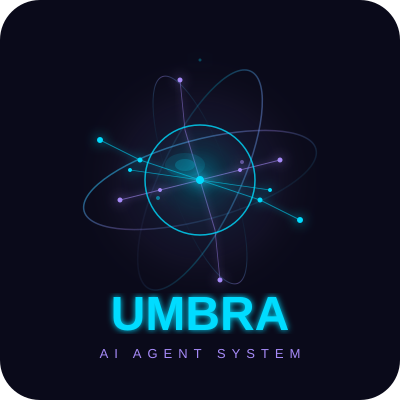

<p align="center">
  
</p>
<p align="center">
  <b>AI Agent System for Automated Trading</b>
</p>

<p align="center">
  
  
  
  
  
  
</p>

# UMBRA

**Version:** 0.3.1
**License:** MIT
**Author:** methodwhite

UMBRA is an open-source AI agent system with multi-agent orchestration, 3D HUD interface, cognitive emotional system, encrypted vault, and MT5 trading integration. Built in Rust with a native egui desktop GUI.

## Quick Start

```bash
git clone https://github.com/MethodWhite/umbra && cd umbra
cargo build --release
./target/release/umbra-gui        # Launch native desktop GUI
```

Full guide: [QUICKSTART.md](QUICKSTART.md)

### Requirements
- **Rust** (latest stable)
- **Synapsis** at `../synapsis/` (path dependency)
- **Ollama** (optional, for local LLM inference via `localhost:11434`)

## Features

- **3D HUD Interface** — 500-particle Fibonacci sphere with emotional color mapping, transparent overlay menus
- **Multi-Agent System** — Agent Parameter Memory with Plutchik's Wheel emotions (80+ states), Cognitive Behavioral Therapy, gender/communication styles
- **23 API Providers** — OpenAI, Anthropic, Google, DeepSeek, Qwen, Ollama, llama.cpp, OpenCode Go, and 15 more
- **Encrypted Vault** — AES-256-GCM + PBKDF2 (600K iterations) credential storage with auto-lock
- **MT5 Trading Panel** — Real-time chart (line/candle), order entry (buy/sell/SL/TP), simulated account, broker config
- **Local TTS** — espeak (fallback), Piper (local), Fish Audio (API). Voice tone adapts to AI emotion
- **Clean Architecture** — Domain/Application/Infrastructure layers with trait-based ports. 47 modular components
- **Supply Chain Security** — cargo-deny, cargo-vet, Dependabot, pinned dependencies, 0 advisories

## Build

```bash
# Desktop GUI (default)
cargo build --release --bin umbra-gui

# CLI API server (requires --features server)
cargo build --release --bin umbra --features server

# Run tests
cargo test --lib --release
```

## Architecture

```
src/
├── desktop/          egui native GUI (HUD, trading, conversations)
├── domain/           Models and port traits (TTS, STT, VoiceID, Security)
├── application/      Use cases (voice, vault, providers, security)
├── infrastructure/   Implementations (--features server only)
├── ai_client/        Ollama/llama.cpp HTTP client
├── agent_memory/     Agent Parameter Memory + Plutchik emotions
├── sphere/           3D Fibonacci sphere renderer
├── audio/            Microphone capture, playback, VAD
├── providers/        LLM provider registry and configuration
├── vault/            Encrypted key-value storage
└── security/         SSRF protection, rate limiting, audit

Server-only (--features server):
  engine/ bridge/ jarvis/ ironclaw/ api/ learning/ infra/
```

## Documentation

- [PAPER.md](PAPER.md) — Technical paper
- [ARCHITECTURE_V2.md](ARCHITECTURE_V2.md) — Architecture overview
- [SPRINTS.md](SPRINTS.md) — Development sprints
- [QA_REPORT.md](QA_REPORT.md) — Quality audit
- [SECURITY_AUDIT.md](SECURITY_AUDIT.md) — Security audit
- [PRODUCT_REVIEW.md](PRODUCT_REVIEW.md) — Product review
- [UIUX_REVIEW.md](UIUX_REVIEW.md) — UI/UX review
